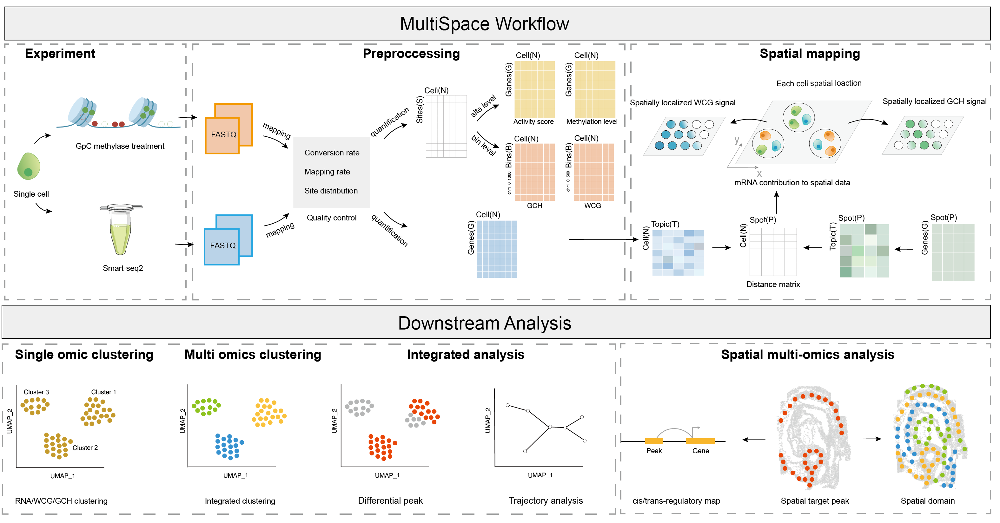

# MultiSpace


[](https://anaconda.org/changzhanhe/multispace)
[](https://anaconda.org/changzhanhe/multispace)
[](https://anaconda.org/changzhanhe/multispace)


MultiSpace(Single-cell Multi-omic Analysis In Space) is a computational framework that combines single-cell multi-omic data such as scCOOL-seq with spatial transcriptomic information. MultiSpace first projects single cells with multi-omic modalities into spatial locations by deconvolution-based cell mapping with transcriptomic data, thereby reconstructing RNA expression, DNA methylation, and chromatin accessibility information in space with high efficiency. MultiSpace then provided several pre-processing functions including generating gene/transposons expression and DNA methylation level, and calculating gene activity scores for both single-cell and spatial data. Besides, MultiSpace also provides rich downstream analysis functions including 1) single and multi-modality clustering, visualization, differential element calling, and trajectory detection, 2) spatial domain identification, spatial variable element calling, and visualization. All these components have been packed using Snakemake workflow for convenient distribution.



## Documentation
For full installation and usage of MultiSpace, please refer to the [documentation](https://multispace.readthedocs.io/en/latest/).


## Change Log
### v0.0.1
* Release MultiSpace.
* Use Snakemake to preprocess raw data. Add pipeline initiation function.
* Add mapping single cell to spatial location, DNA methylation ratio, gene activity score using RP-model functions.

### v0.0.2
* Add calculating repeats elements(LINE and LTR) expression and methylation level function.
* Upload hg38 and mm10 repeats annotation files.

## Installation
### Use the following commands to install Minicoda3：
``` bash
$ wget https://repo.continuum.io/miniconda/Miniconda3-latest-Linux-x86_64.sh
$ bash Miniconda3-latest-Linux-x86_64.sh
```
### Install MultiSpace from Github (developing version)
```bash
git clone https://github.com/Changzhanhe/MultiSpace.git
cd MultiSpace
# Create a conda environment for MultiSpace.
conda env create -f environment.yml -n multispace
# Installing package
conda activate multispace
python setup.py install
```

### Install MultiSpace using conda (stable version)
```bash
# Create a python3.8 environment for installing MultiSpace.
conda create -n multispace python=3.8
# Install through the following commands:
conda config --add channels defaults
conda config --add channels dongqingsun
conda config --add channels bioconda
conda config --add channels conda-forge
conda config --add channels changzhanhe
conda install -c changzhanhe multispace
```

## Usage
```bash
usage: MultiSpace [-h] [-v] {Pipelineinit,Scorematrix,Mappingcell} ...

MultiSpace(Single-cell Multi Omics Analysis In Space) is a multi-omics pipeline integrated RNA Expression, DNA methylation and Chromatin Accessibility analysis built using snakemake.

positional arguments:
  {Pipelineinit,Scorematrix,Mappingcell}
    Pipelineinit        Initialize the MultiSpace preprocessing workflow in a given directory. This will install the snakemake rules and a config file in this directory. You can configure the config file
                        according to your needs, and run the workflow with Snakemake.
    Scorematrix         Calculate each gene a gene by cell score matrix across all cells. WCG: Genebody/Promoter methylation ratio matrix. GCH: Gene activity score matrix.
    Mappingcell         Map single cell to spatial location according to expression similarity and get spatial epigenetic signal.

optional arguments:
  -h, --help            show this help message and exit
  -v, --version         Print version info.
```
