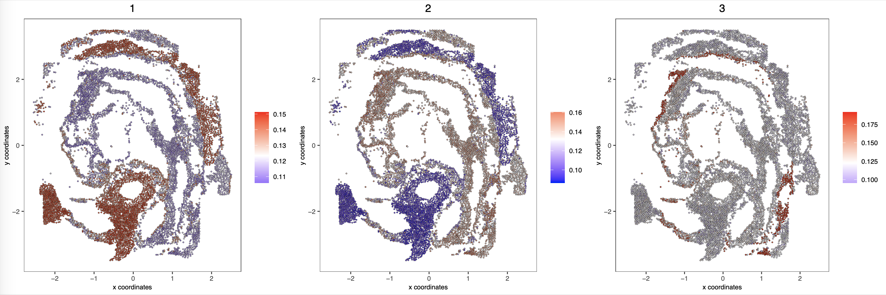

.. highlight:: shell

.. role:: bash(code)
   :language: bash

Mouse embryo E7.5 scNMT-seq data
---------------------------------

Here we use a multi-omics scNMT-seq dataset to demonstrate the simple usage of MultiSpace. The scNMT-seq data was derived from the study of early mouse embryo (`Argelaguet et al., Nature, 2019 <https://www.nature.com/articles/s41586-019-1825-8>`_). Only data of E7.5 are used in this example. The spatial data was collected from E8.5 mouse embryo (`Lohoff et al., Nature, 2022 <https://www.nature.com/articles/s41587-021-01006-2>`_). 

Step 1 Run MultiSpace pipeline_init to initialize snakemake
>>>>>>>>>>>>>>>>>>>>>>>>>>>>>>>>>>>>>>>>>>>>>>>>>>>>>>>>>>>>

The first step of running MultiSpace pipeline is to initialize pipeline config file (also initiation sample in same file)and a working directory. All these steps are implemented by :bash:`MultiSpace pipeline_init` function. 
::

   MultiSpace pipeline_init --species mm10 \
   --samplesheet metasheet.csv \
   --directory ~/Project/scNMT_WolfReik/ \
   --fasta ~/Reference/mm10.fa \
   --fasta_fai ~/Reference/mm10.fa.fai \
   --lambda_fasta ~/Reference/mm10_lambda.fa \
   --star_annotation ~/Reference/UCSC_mm10/mm10.refGene.gtf \
   --star_index ~/Reference/UCSC_mm10/

The results of :bash:`MultiSpace pipeline_init` are shown as below.

+---------------------------------------------------+---------------------------------------------------------------------------+
| File                                              | Description                                                               |
+===================================================+===========================================================================+
| config.yaml                                       | Initialized config.yaml generated in user input directory.                |
+---------------------------------------------------+---------------------------------------------------------------------------+
| Snakefile                                         | Snakefile in directory used for running snakemake.                        |
+---------------------------------------------------+---------------------------------------------------------------------------+
| modules/                                          | Snakemake rules stored in subdir modules of directory.                    |
+---------------------------------------------------+---------------------------------------------------------------------------+

Step 2 Run snakemake to preprocess raw data
>>>>>>>>>>>>>>>>>>>>>>>>>>>>>>>>>>>>>>>>>>>>

After initialize config file and working directory, :bash:`snakemake -j 5` could be used to run snakemake in working directory. Users can customize cores number ,but be careful not to make the number too large in case limited memory.

::

   cd ~/Project/scNMT_WolfReik/
   snakemake -j 5

The results of :bash:`snakemake -j 5` are shown as below.
DNA methylation(WCG, W=A or T)
Chromatin accessibility(GCH, H=A, C or T)

+---------------------------------------------------+---------------------------------------------------------------------------+
| File                                              | Description                                                               |
+===================================================+===========================================================================+
| GCH.bin_peak.h5                                   | GCH bin by cell marix stored in H5 format.                                |
+---------------------------------------------------+---------------------------------------------------------------------------+
| WCG.bin_peak.h5                                   | WCG bin by cell marix stored in H5 format.                                |
+---------------------------------------------------+---------------------------------------------------------------------------+
| GCH.bin.merge.peak                                | GCH bin features. Rowname of GCH.bin_peak.h5                              |
+---------------------------------------------------+---------------------------------------------------------------------------+
| WCG.bin.merge.peak                                | WCG bin features. Rowname of WCG.bin_peak.h5                              |
+---------------------------------------------------+---------------------------------------------------------------------------+
| GCH.chr1_chr6.site_peak.h5                        | GCH site by cell matrix separated by chromatin stored in H5 format.       |
| GCH.chr7_chr12.site_peak.h5                       |                                                                           |
| GCH.chr13_chrY.site_peak.h5                       |                                                                           |
+---------------------------------------------------+---------------------------------------------------------------------------+
| WCG.site_peak.h5                                  | WCG site by cell matrix stored in H5 format.                              |
+---------------------------------------------------+---------------------------------------------------------------------------+
| WCG.uniq.peak                                     | WCG site features. Rowname of WCG.site_peak.h5                            |
+---------------------------------------------------+---------------------------------------------------------------------------+
| GCH.uniq.peak                                     | GCH site features. Rowname of GCH.site_peak.h5(merge chromtain together)  |
+---------------------------------------------------+---------------------------------------------------------------------------+
| QCtable.txt                                       | Snakemake rules stored in subdir modules of directory.                    |
+---------------------------------------------------+---------------------------------------------------------------------------+
| usecell.txt                                       | Snakemake rules stored in subdir modules of directory.                    |
+---------------------------------------------------+---------------------------------------------------------------------------+
| QCtable.txt                                       | Snakemake rules stored in subdir modules of directory.                    |
+---------------------------------------------------+---------------------------------------------------------------------------+

Step 3 Run MultiSpace wcg_methratio to calculate genebody methylation ratio
>>>>>>>>>>>>>>>>>>>>>>>>>>>>>>>>>>>>>>>>>>>>>>>>>>>>>>>>>>>>>>>>>>>>>>>>>>>>>

MultiSpace wcg_methratio can calculate genebody or gene promoter methylation ratio using snakemake output file.

::

   MultiSpace wcg_methratio --species mm10 --cell_barcode 04.WCG.GCH/usecell.txt \
   --peak_reference 04.WCG.GCH/WCG.uniq.peak --meth_matrix 04.WCG.GCH/WCG.site_peak.h5 \
   --outdir . --region genebody --distance 2000

The results of :bash:`MultiSpace wcg_methratio` are gene by cell matrix stored in TXT format.

Step 4 Run MultiSpace gch_geneactivity to calculate gene activity score
>>>>>>>>>>>>>>>>>>>>>>>>>>>>>>>>>>>>>>>>>>>>>>>>>>>>>>>>>>>>>>>>>>>>>>>>>>>>>

MultiSpace gch_methratio can calculate gene activity score using RP(regulatory potential) model.

::

   MultiSpace gch_geneactivity --species mm10 --cell_barcode 04.WCG.GCH/usecell.txt \
   --file_path 04.WCG.GCH/ --outdir . 

The results of :bash:`MultiSpace gch_geneactivity` are gene by cell matrix stored in TXT format.

Step 5 Run MultiSpace getting_episignal to get spatial epigenetic signal
>>>>>>>>>>>>>>>>>>>>>>>>>>>>>>>>>>>>>>>>>>>>>>>>>>>>>>>>>>>>>>>>>>>>>>>>>>>>>

MultiSpace gch_methratio can calculate gene activity score using RP(regulatory potential) model.
Users can take :bash:`snakemake` output single cell gene expression matrix, bin by cell matrix and bin features as input.
::

   MultiSpace getting_episignal --sc_count_file 05.Spatial/RNA_normalized.txt --sc_celltype_file celltype.txt \
   --st_count_file Spatial/seqFISH_scRNA/RNA_st_normalized.txt --spatial_location Spatial/seFISH_scRNA/loc_EM1.txt \
   --epi_binfile WCG.bin_peak.h5 --epi_feature WCG.bin.merge.peak --out_dir . --out_prefix WCG

Users can use :bash:`MultiSpace getting_episignal --help` to see help message.
The results are showed below.

+---------------------------------------------------+---------------------------------------------------------------------------+
| File                                              | Description                                                               |
+===================================================+===========================================================================+
| WCG.signal_mat.npz                                | DNA methylation signal in spatila location.                               |
|                                                   | Bin feature by spot matrix stored in .npz format.                         |
+---------------------------------------------------+---------------------------------------------------------------------------+
| WCG.signal_mat_rowname.txt                        | Rownames of bin feature by spot matrix after filtering.                   |
|                                                   | Colnames of bin feature by spot matrix is colnames of st_count_file.      |
+---------------------------------------------------+---------------------------------------------------------------------------+

Validate mapping accuracy:

.. image:: ../_static/img/thumbnail/validate.png
   :height: 350px
   :align: center

Users can use Giotto to get spatially epigenetic domain:

