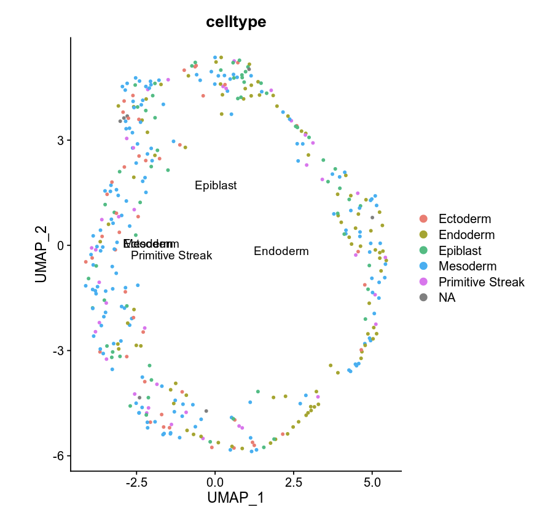

Mouse embryo scNMT-seq data
=================================

Here we use a multi-omics scNMT-seq dataset to demonstrate the simple usage of MultiSpace. The scNMT-seq data was derived from the study of early mouse embryo (`Argelaguet et al., Nature, 2019 <https://www.nature.com/articles/s41586-019-1825-8>`_). From E4.5 to E7.5 are used in this example. The spatial data was collected from E8.5 mouse embryo (`Lohoff et al., Nature, 2022 <https://www.nature.com/articles/s41587-021-01006-2>`_). 

Using MultiSpace to analysis
~~~~~~~~~~~~~~~~~~~~~~~~~~~~~~

Take E8.5 scNMT-seq data for example. Users should better separate data in absolute folder if they have more than one stage.

Step 1 Run MultiSpace Pipelineinit to initialize snakemake
>>>>>>>>>>>>>>>>>>>>>>>>>>>>>>>>>>>>>>>>>>>>>>>>>>>>>>>>>>>>

The first step of running MultiSpace pipeline is to initialize pipeline config file (also initiation sample in same file)and a working directory. All these steps are implemented by :bash:`MultiSpace Pipelineinit` function. 

.. code:: shell

   MultiSpace Pipelineinit --species mm10 \
   --samplesheet metasheet.csv \
   --directory ~/Project/scNMT_WolfReik/ \
   --fasta ~/Reference/mm10.fa \
   --fasta_fai ~/Reference/mm10.fa.fai \
   --lambda_fasta ~/Reference/mm10_lambda.fa \
   --star_annotation ~/Reference/UCSC_mm10/mm10.refGene.gtf \
   --star_index ~/Reference/UCSC_mm10/

The results of :bash:`MultiSpace Pipelineinit` are shown as below.

+---------------------------------------------------+---------------------------------------------------------------------------+
| File                                              | Description                                                               |
+===================================================+===========================================================================+
| config.yaml                                       | Initialized config.yaml generated in user input directory.                |
+---------------------------------------------------+---------------------------------------------------------------------------+
| Snakefile                                         | Snakefile in directory used for running snakemake.                        |
+---------------------------------------------------+---------------------------------------------------------------------------+
| modules/                                          | Snakemake rules stored in subdir modules of directory.                    |
+---------------------------------------------------+---------------------------------------------------------------------------+

Step 2 Run snakemake to preprocess raw data
>>>>>>>>>>>>>>>>>>>>>>>>>>>>>>>>>>>>>>>>>>>>

After initialize config file and working directory, :bash:`snakemake -j 5` could be used to run snakemake in working directory. Users can customize cores number ,but be careful not to make the number too large in case limited memory.

.. code:: shell

   cd ~/Project/scNMT_WolfReik/
   snakemake -j 5

The results of :bash:`snakemake -j 5` are shown as below. DNA methylation(WCG, W=A or T). Chromatin accessibility(GCH, H=A, C or T)

+---------------------------------------------------+---------------------------------------------------------------------------+
| File                                              | Description                                                               |
+===================================================+===========================================================================+
| GCH.bin_peak.h5                                   | GCH bin by cell marix stored in H5 format.                                |
+---------------------------------------------------+---------------------------------------------------------------------------+
| WCG.bin_peak.h5                                   | WCG bin by cell marix stored in H5 format.                                |
+---------------------------------------------------+---------------------------------------------------------------------------+
| GCH.bin.merge.peak                                | GCH bin features. Rowname of GCH.bin_peak.h5                              |
+---------------------------------------------------+---------------------------------------------------------------------------+
| WCG.bin.merge.peak                                | WCG bin features. Rowname of WCG.bin_peak.h5                              |
+---------------------------------------------------+---------------------------------------------------------------------------+
| GCH.chr1_chr6.site_peak.h5                        | GCH site by cell matrix separated by chromatin stored in H5 format.       |
| GCH.chr7_chr12.site_peak.h5                       |                                                                           |
| GCH.chr13_chrY.site_peak.h5                       |                                                                           |
+---------------------------------------------------+---------------------------------------------------------------------------+
| WCG.site_peak.h5                                  | WCG site by cell matrix stored in H5 format.                              |
+---------------------------------------------------+---------------------------------------------------------------------------+
| WCG.uniq.peak                                     | WCG site features. Rowname of WCG.site_peak.h5                            |
+---------------------------------------------------+---------------------------------------------------------------------------+
| GCH.uniq.peak                                     | GCH site features. Rowname of GCH.site_peak.h5(merge chromtain together)  |
+---------------------------------------------------+---------------------------------------------------------------------------+
| QCtable.txt                                       | Snakemake rules stored in subdir modules of directory.                    |
+---------------------------------------------------+---------------------------------------------------------------------------+
| usecell.txt                                       | Snakemake rules stored in subdir modules of directory.                    |
+---------------------------------------------------+---------------------------------------------------------------------------+
| QCtable.txt                                       | Snakemake rules stored in subdir modules of directory.                    |
+---------------------------------------------------+---------------------------------------------------------------------------+

Step 3 Run MultiSpace Scorematrix to calculate WCG/GCH score matrix
>>>>>>>>>>>>>>>>>>>>>>>>>>>>>>>>>>>>>>>>>>>>>>>>>>>>>>>>>>>>>>>>>>>>>>>>>>>>>

MultiSpace Scorematrix can calculate genebody or gene promoter methylation ratio using snakemake output file.

.. code:: shell

   MultiSpace Scorematrix --species mm10 --cell_barcode 04.WCG.GCH/usecell.txt \
   --file_path 04.WCG.GCH/ --outdir . --matrixtype WCG --region promoter --distance 2000

The results of :bash:`MultiSpace Scorematrix` are gene by cell matrix stored in TXT format.

MultiSpace Scorematrix can calculate gene activity score using RP(regulatory potential) model.

.. code:: shell

   MultiSpace Scorematrix --species mm10 --cell_barcode 04.WCG.GCH/usecell.txt \
   --file_path 04.WCG.GCH/ --outdir . --matrixtype GCH --distance 10000

The results of :bash:`MultiSpace Scorematrix` are gene by cell matrix stored in TXT format.

Step 4 Run MultiSpace Mappingcell to map single cell to spatial
>>>>>>>>>>>>>>>>>>>>>>>>>>>>>>>>>>>>>>>>>>>>>>>>>>>>>>>>>>>>>>>>>>>>>>>>>>>>>

MultiSpace Mappingcell can map single cell to spatial location, and get spatially epigenetic signal.
Users can take :bash:`snakemake` output single cell gene expression matrix, bin by cell matrix and bin features as input.
Additionally, users should offer a spatial gene count matrix and cell type file. The count matrix could be tab-separated plain-text file with genes as rows and spots as columns. The celltype file should be a tab-separated plain-text file without header. The first column should be the cell name, and the second column should be the corresponding celltype labels.

.. code:: shell

   MultiSpace Mappingcell --sc_count_file 05.Spatial/RNA_normalized.txt --sc_celltype_file celltype.txt \
   --st_count_file Spatial/seqFISH_scRNA/RNA_st_normalized.txt --spatial_location Spatial/seFISH_scRNA/loc_EM1.txt \
   --epi_binfile WCG.bin_peak.h5 --epi_feature WCG.bin.merge.peak --out_dir . --out_prefix WCG

Users can use :bash:`MultiSpace Mappingcell --help` to see help message.
The results are showed below.

+---------------------------------------------------+---------------------------------------------------------------------------+
| File                                              | Description                                                               |
+===================================================+===========================================================================+
| WCG.signal_mat.npz                                | DNA methylation signal in spatila location.                               |
|                                                   | Bin feature by spot matrix stored in .npz format.                         |
+---------------------------------------------------+---------------------------------------------------------------------------+
| WCG.signal_mat_rowname.txt                        | Rownames of bin feature by spot matrix after filtering.                   |
|                                                   | Colnames of bin feature by spot matrix is colnames of st_count_file.      |
+---------------------------------------------------+---------------------------------------------------------------------------+

Validate mapping accuracy:

.. image:: ../_static/img/thumbnail/validate.png
   :height: 350px

Mapping E7.5 scNMT-seq data to E8.5 spatial location:

MultiSpace output file downstream analysis
~~~~~~~~~~~~~~~~~~~~~~~~~~~~~~~~~~~~~~~~~~~~

Users can use :bash:`snakemake` output file to do downstream analysis.

Single omic clustering
>>>>>>>>>>>>>>>>>>>>>>>>>>>>>>>>>>>>>>>>>>>>>>>>>>>>>>>>>>>>

Using Seurat to cluster RNA gene count matrix by stage and celltype.

Mouse embryo gene count matrix cluster by stage(from E4.5 to E7.5)

.. code:: r

   library(Seurat)
   library(ggplot2)
   library(patchwork)
   library(dplyr)
   library(data.table)
   library(stringr)
   samplemeta = read.table("allsamplemeta.txt",sep = " ", header = T)
   RNA_mat <- as.data.frame(read.table("RNA_normalized.txt",header = T,row.names = 1, check.names=FALSE))

   scseurat <- CreateSeuratObject(
    counts = RNA_mat,
    project = "RNA",
    assay = "RNA",
    min.cells = 5
   )
   scseurat@meta.data$type <- "rna"
   scseurat@meta.data$sample <- rownames(scseurat@meta.data)
   scseurat@meta.data = merge(samplemeta,scseurat@meta.data,on = "sample")
   rownames(scseurat@meta.data) = scseurat@meta.data$sample

   scseurat <- NormalizeData(scseurat) %>% ScaleData() 
   scseurat <- SCTransform(scseurat, assay = "RNA",  verbose = FALSE)
   scseurat <- RunPCA(scseurat, dims = 1:30)
   scseurat <- RunUMAP(scseurat, dims = 1:30)
   scseurat <- FindNeighbors(scseurat, dims = 1:30)
   scseurat <- FindClusters(scseurat, resolution = 0.5, verbose = FALSE)

   DimPlot(scseurat,reduction = "umap",group.by = "stage")

Mouse embryo gene count matrix cluster by celltype in E7.5.

.. code:: r

   e75samplemeta = samplemeta[which(samplemeta$stage == "E7.5"),]
   e75RNA_mat = RNA_mat[,which(colnames(RNA_mat) %in% e75samplemeta$sample)]

   e75scseurat <- CreateSeuratObject(
    counts = e75RNA_mat,
    project = "RNA",
    assay = "RNA",
    min.cells = 3
   )
   e75scseurat@meta.data$type <- "rna"
   e75scseurat@meta.data$orig.ident <- "E7.5"
   e75scseurat@meta.data$sample <- rownames(e75scseurat@meta.data)
   e75scseurat@meta.data = merge(samplemeta,e75scseurat@meta.data,on = "sample")
   rownames(e75scseurat@meta.data) = e75scseurat@meta.data$sample

   e75scseurat <- SCTransform(e75scseurat, assay = "RNA",  verbose = FALSE)
   e75scseurat <- RunPCA(e75scseurat, dims = 1:30)
   e75scseurat <- RunUMAP(e75scseurat, dims = 1:30)
   e75scseurat <- FindNeighbors(e75scseurat, dims = 1:30)
   e75scseurat <- FindClusters(e75scseurat, resolution = 0.5, verbose = FALSE)

   DimPlot(e75scseurat,reduction = "umap",group.by = "celltype")

.. image:: ../_static/img/thumbnail/clusterbycelltype.png
   :height: 350px
   :align: center

Using Signac to cluster WCG/GCH bin count matrix by stage(from E4.5 to E7.5).
Take WCG bin matrix for example.

.. code:: r

   library(Signac)
   library(Seurat)
   library(ggplot2)
   library(stringr)
   library(reticulate)
   library(Matrix)
   np <- import("numpy")
   scipy <-import("scipy")

   feature = read.csv("WCG.bin.merge.peak",header = F)
   usecell <- read.table("usecells.txt")
   mydata <- h5read("WCG.bin_peak.h5", "Mcsc")
   WCG_mat = sparseMatrix(x = as.numeric(mydata$data),j = as.numeric(mydata$indices),p = as.numeric(mydata$indptr),dims = c(4114260,985),index1 = FALSE)
   colnames(WCG_mat) = usecell$V1
   rownames(WCG_mat) = feature$V1
   meta <- read.table("sample_metadata.txt",sep = "\t", header = T)
   samplemeta = merge(meta,usecell, by.x = "sample",by.y = "V1")[,c('sample','stage','lineage10x')]
   rownames(samplemeta) = samplemeta$sample
   samplemeta$celltype = samplemeta$lineage10x

   WCG <- CreateSeuratObject(
    counts = WCG_mat,
    assay = "peaks",
    min.cells = 5,
    meta = samplemeta
   )
   WCG@meta.data$celltype = samplemeta$celltype

   WCG <- RunTFIDF(WCG)
   WCG <- FindTopFeatures(WCG, min.cutoff = "q90")
   WCG <- RunSVD(WCG)
   WCG <- RunUMAP(
     object = WCG,
     reduction = 'lsi',
     dims = 2:20
   )

   DimPlot(object = WCG, label = TRUE, reduction = "umap", group.by = "stage")

.. image:: ../_static/img/thumbnail/wcgclusterbystage.png
   :width: 50 %

Using Signac to cluster WCG/GCH bin count matrix by celltype in E7.5.

.. code:: r

   e75samplemeta = samplemeta[which(samplemeta$stage == "E7.5"),]
   WCG_mat = WCG_mat[,e75samplemeta$sample]
   e75WCG <- CreateSeuratObject(
    counts = WCG_mat,
    assay = "peaks",
    min.cells = 3,
    meta = e75samplemeta
   )
   e75WCG@meta.data$celltype = e75samplemeta$celltype

   e75WCG <- RunTFIDF(e75WCG)
   e75WCG <- FindTopFeatures(e75WCG, min.cutoff = "q90")
   e75WCG <- RunSVD(e75WCG)
   e75WCG <- RunUMAP(
     object = e75WCG,
     reduction = 'lsi',
     dims = 2:20
   )

   DimPlot(object = e75WCG, label = TRUE, reduction = "umap", group.by = "celltype")

Multi omics clustering
>>>>>>>>>>>>>>>>>>>>>>>>>>>>>>>>>>>>>>>>>>>>>>>>>>>>>>>>>>>>

.. code:: r

   library(reticulate)
   library(Seurat)
   library(Signac)
   library(dplyr)
   library(ggplot2)
   library(rhdf5)
   library(Matrix)
   np <- import("numpy")
   scipy <-import("scipy")
   h5py <- import("h5py")

   meta <- read.table("sample_metadata.txt",sep = "\t", header = T)
   usecell <- read.table("usecells.txt")
   samplemeta = merge(meta,usecell, by.x = "sample",by.y = "V1")[,c('sample','stage','lineage10x')]
   rownames(samplemeta) = samplemeta$sample
   samplemeta$celltype = samplemeta$lineage10x

   RNA_mat <- as.data.frame(read.table("RNA_normalized.txt",header = T,row.names = 1, check.names=FALSE))

   wcgfeature = read.csv("WCG.bin.merge.peak",header = F)
   mydata <- h5read("WCG.bin_peak.h5", "Mcsc")
   WCG_mat = sparseMatrix(x = as.numeric(mydata$data),j = as.numeric(mydata$indices),p = as.numeric(mydata$indptr),dims = c(4114260,985),index1 = FALSE)
   colnames(WCG_mat) = usecell$V1
   rownames(WCG_mat) = wcgfeature$V1

   gchfeature = read.csv("GCH.bin.merge.peak",header = F)
   mydata <- h5read("GCH.bin_peak.h5", "Mcsc")
   GCH_mat = sparseMatrix(x = as.numeric(mydata$data),j = as.numeric(mydata$indices),p = as.numeric(mydata$indptr),dims = c(2645763,985),index1 = FALSE)
   colnames(GCH_mat) = usecell$V1
   rownames(GCH_mat) = gchfeature$V1

   seurat <- CreateSeuratObject(
    counts = RNA_mat,
    project = "RNA",
    assay = "RNA",
    metadata = samplemeta,
    min.cells = 5
   )
   seurat[['WCG']] <- CreateAssayObject(counts = WCG_mat,min.cells = 10)
   seurat[['GCH']] <- CreateAssayObject(counts = GCH_mat,min.cells = 10)
   seurat@meta.data <- cbind(seurat@meta.data,samplemeta)

   # RNA analysis
   DefaultAssay(seurat) <- "RNA"
   seurat <- SCTransform(seurat, verbose = FALSE) %>% RunPCA() %>% RunUMAP(dims = 1:50, reduction.name = 'umap.rna', reduction.key = 'rnaUMAP_')

   # WCG analysis
   # We exclude the first dimension as this is typically correlated with sequencing depth
   DefaultAssay(seurat) <- "WCG"
   seurat <- RunTFIDF(seurat)
   seurat <- FindTopFeatures(seurat, min.cutoff = 'q90')
   seurat <- RunSVD(seurat)
   seurat <- RunUMAP(seurat, reduction = 'lsi', dims = 2:50, reduction.name = "umap.wcg", reduction.key = "wcgUMAP_")

   # GCH analysis
   # We exclude the first dimension as this is typically correlated with sequencing depth
   DefaultAssay(seurat) <- "GCH"
   seurat <- RunTFIDF(seurat)
   seurat <- FindTopFeatures(seurat, min.cutoff = 'q90')
   seurat <- RunSVD(seurat)
   seurat <- RunUMAP(seurat, reduction = 'lsi', dims = 2:50, reduction.name = "umap.gch", reduction.key = "gchUMAP_")

   DefaultAssay(seurat) <- "RNA"
   seurat <- FindMultiModalNeighbors(seurat, reduction.list = list("pca", "lsi","lsi"), dims.list = list(1:50, 2:50, 2:50))
   seurat <- RunUMAP(seurat, nn.name = "weighted.nn", reduction.name = "wnn.umap", reduction.key = "wnnUMAP_")
   seurat <- FindClusters(seurat, graph.name = "wsnn", algorithm = 3, verbose = FALSE)

   p1 <- DimPlot(seurat, reduction = "umap.rna", group.by = "stage", label = TRUE, label.size = 2.5, pt.size = 2, repel = TRUE) + ggtitle("RNA")
   p2 <- DimPlot(seurat, reduction = "umap.wcg", group.by = "stage", label = TRUE, label.size = 2.5, pt.size = 2, repel = TRUE) + ggtitle("WCG")
   p3 <- DimPlot(seurat, reduction = "umap.gch", group.by = "stage", label = TRUE, label.size = 2.5, pt.size = 2, repel = TRUE) + ggtitle("GCH")
   p4 <- DimPlot(seurat, reduction = "wnn.umap", group.by = "stage", label = TRUE, label.size = 2.5, pt.size = 2, repel = TRUE) + ggtitle("WNN")
   p1 + p2 + p3 +p4 & NoLegend() & theme(plot.title = element_text(hjust = 0.5))

.. code:: r

   E75meta <- samplemeta[samplemeta$stage == "E7.5" & samplemeta$celltype %in% c("Endoderm","Ectoderm","Mesoderm"),]
   RNA_mat <- RNA_mat[,E75meta$sample]
   seurat <- CreateSeuratObject(
    counts = RNA_mat,
    project = "RNA",
    assay = "RNA",
    metadata = E75meta,
    min.cells = 3
   )
   seurat@meta.data <- cbind(seurat@meta.data,E75meta)
   GCH_mat <- GCH_mat[,E75meta$sample]
   seurat[['GCH']] <- CreateAssayObject(counts = GCH_mat,min.cells = 5)
   WCG_mat <- WCG_mat[,E75meta$sample]
   seurat[['WCG']] <- CreateAssayObject(counts = WCG_mat,min.cells = 5)

   # RNA analysis
   DefaultAssay(seurat) <- "RNA"
   seurat <- SCTransform(seurat, verbose = FALSE) %>% RunPCA() %>% RunUMAP(dims = 1:50, reduction.name = 'umap.rna', reduction.key = 'rnaUMAP_')
   #Note that this single command replaces NormalizeData(), ScaleData(), and FindVariableFeatures()
   # GCH analysis
   # We exclude the first dimension as this is typically correlated with sequencing depth
   DefaultAssay(seurat) <- "GCH"
   seurat <- RunTFIDF(seurat)
   seurat <- FindTopFeatures(seurat, min.cutoff = 'q90')
   seurat <- RunSVD(seurat)
   seurat <- RunUMAP(seurat, reduction = 'lsi', dims = 2:50, reduction.name = "umap.gch", reduction.key = "gchUMAP_")

   # RNA+GCH
   DefaultAssay(seurat) <- "RNA"
   seurat <- FindMultiModalNeighbors(seurat, reduction.list = list("pca", "lsi"), dims.list = list(1:50, 2:50),knn.range = 170,sd.scale = 1,k.nn = 30)
   seurat <- RunUMAP(seurat, nn.name = "weighted.nn", reduction.name = "wnn.umap", reduction.key = "wnnUMAP_")
   seurat <- FindClusters(seurat, graph.name = "wsnn", algorithm = 3, verbose = FALSE)

   pdf("GCH+RNA.pdf",width = 10,height = 5)
   p1 <- DimPlot(seurat, reduction = "umap.rna", group.by = "celltype", label = TRUE, label.size = 2.5, pt.size = 2, repel = TRUE) + ggtitle("RNA")
   p2 <- DimPlot(seurat, reduction = "umap.gch", group.by = "celltype", label = TRUE, label.size = 2.5, pt.size = 2, repel = TRUE) + ggtitle("GCH")
   p3 <- DimPlot(seurat, reduction = "wnn.umap", group.by = "celltype", label = TRUE, label.size = 2.5, pt.size = 2, repel = TRUE) + ggtitle("WNN")
   p1 + p2 +p3  & theme(plot.title = element_text(hjust = 0.5))
   dev.off()

   # RNA analysis
   DefaultAssay(seurat) <- "RNA"
   seurat <- SCTransform(seurat, verbose = FALSE) %>% RunPCA() %>% RunUMAP(dims = 1:50, reduction.name = 'umap.rna', reduction.key = 'rnaUMAP_')
   # WCG analysis
   # We exclude the first dimension as this is typically correlated with sequencing depth
   DefaultAssay(seurat) <- "WCG"
   seurat <- RunTFIDF(seurat)
   seurat <- FindTopFeatures(seurat, min.cutoff = 'q90')
   seurat <- RunSVD(seurat)
   seurat <- RunUMAP(seurat, reduction = 'lsi', dims = 2:50, reduction.name = "umap.wcg", reduction.key = "wcgUMAP_")

   # RNA+WCG
   DefaultAssay(seurat) <- "RNA"
   seurat <- FindMultiModalNeighbors(seurat, reduction.list = list("pca", "lsi"), dims.list = list(1:50, 2:50),knn.range = 170,sd.scale = 1,k.nn = 30)
   seurat <- RunUMAP(seurat, nn.name = "weighted.nn", reduction.name = "wnn.umap", reduction.key = "wnnUMAP_")
   seurat <- FindClusters(seurat, graph.name = "wsnn", algorithm = 3, verbose = FALSE)

   pdf("WCG+RNA.pdf",width = 10,height = 5)
   p1 <- DimPlot(seurat, reduction = "umap.rna", group.by = "celltype", label = TRUE, label.size = 2.5, pt.size = 2, repel = TRUE) + ggtitle("RNA")
   p2 <- DimPlot(seurat, reduction = "umap.wcg", group.by = "celltype", label = TRUE, label.size = 2.5, pt.size = 2, repel = TRUE) + ggtitle("WCG")
   p3 <- DimPlot(seurat, reduction = "wnn.umap", group.by = "celltype", label = TRUE, label.size = 2.5, pt.size = 2, repel = TRUE) + ggtitle("WNN")
   p1 + p2 +p3  & theme(plot.title = element_text(hjust = 0.5))
   dev.off()

Spatial multi-omics analysis
>>>>>>>>>>>>>>>>>>>>>>>>>>>>>>>>>>>>>>>>>>>>>>>>>>>>>>>>>>>>

.. code:: r

   library(reticulate)
   library(data.table)
   library(dplyr)
   library(ggplot2)
   library(Seurat)
   library(Matrix)
   library(Giotto)
   library(Signac)
   np <- import("numpy")
   scipy <-import("scipy")

   temp_dir = getwd()
   temp_dir = '~/Temp/'
   myinstructions = createGiottoInstructions(save_dir = temp_dir,
                                             save_plot = TRUE, 
                                             show_plot = FALSE)

   # initialize spatial expression matrix
   expr =  scipy$sparse$load_npz('../STRIDE/WCG_methy_mat.npz')
   row = read.csv("../STRIDE/WCG_methy_mat_row.txt",header = FALSE)
   spa_loc = read.table("Spa_location_Emb1z5.txt",sep = "\t")
   rownames(expr) = row$V1
   colnames(expr) = rownames(spa_loc)

   signac <- CreateAssayObject(counts = expr)
   signac <- RunTFIDF(signac)
   signac <- FindTopFeatures(signac, min.cutoff = "q90")
   rownames(expr) <- rownames(signac@data)
   # giotto object 
   seqfish_mini <- createGiottoObject(raw_exprs = expr,
                                      norm_expr = signac@data,
                                      spatial_locs = spa_loc,
                                      instructions = myinstructions,cores = 3)

   ## spatial grid
   seqfish_mini <- createSpatialGrid(gobject = seqfish_mini,
                                sdimx_stepsize = 0.5,
                                sdimy_stepsize = 0.5,minimum_padding = 0.1)

   spatPlot(gobject = seqfish_mini, show_grid = T, point_size = 1.5,
            save_param = c(save_name = '8_a_grid'))

   ## delaunay network: stats + creation
   plotStatDelaunayNetwork(gobject = seqfish_mini, maximum_distance = 400, save_plot = F)
   seqfish_mini = createSpatialNetwork(gobject = seqfish_mini, minimum_k = 10, maximum_distance_delaunay = 400)

   km_spatialgenes = binSpect(seqfish_mini, bin_method = 'rank', cores = 3)
   spatGenePlot(seqfish_mini, expression_values = 'normalized', genes = km_spatialgenes[c(1:4),]$genes,
                point_shape = 'border', point_border_stroke = 0.1,
                show_network = F, network_color = 'lightgrey', point_size = 0.8, 
                cow_n_col = 2,
                save_param = list(save_name = '10_a_spatialgenes_km'))

   # 1. calculate spatial correlation scores 
   ext_spatial_genes = km_spatialgenes[1:2500]$genes
   spat_cor_netw_DT = detectSpatialCorGenes(seqfish_mini,
                                            method = 'network', 
                                            spatial_network_name = 'Delaunay_network',
                                            subset_genes = ext_spatial_genes)

   # 2. cluster correlation scores
   spat_cor_netw_DT = clusterSpatialCorGenes(spat_cor_netw_DT, 
                                             name = 'spat_netw_clus', k = 2)
   heatmSpatialCorGenes(seqfish_mini, spatCorObject = spat_cor_netw_DT, 
                        use_clus_name = 'spat_netw_clus')

.. image:: ../_static/img/thumbnail/binspectclustercorrelation.png
   :height: 350px
   :align: center

.. code:: r 

   netw_ranks = rankSpatialCorGroups(seqfish_mini, 
                                     spatCorObject = spat_cor_netw_DT, 
                                     use_clus_name = 'spat_netw_clus')

   cluster_genes_DT = showSpatialCorGenes(spat_cor_netw_DT, 
                                          use_clus_name = 'spat_netw_clus',
                                          show_top_genes = 1)
   cluster_genes = cluster_genes_DT$clus; names(cluster_genes) = cluster_genes_DT$gene_ID

   seqfish_mini = createMetagenes(seqfish_mini, gene_clusters = cluster_genes, name = 'cluster_metagene')
   spatCellPlot(seqfish_mini,
                spat_enr_names = 'cluster_metagene',
                cell_annotation_values = netw_ranks$clusters,
                point_size = 0.7, cow_n_col = 3)

.. image:: ../_static/img/thumbnail/epi_cluster.png
   :height: 350px
   :align: center

