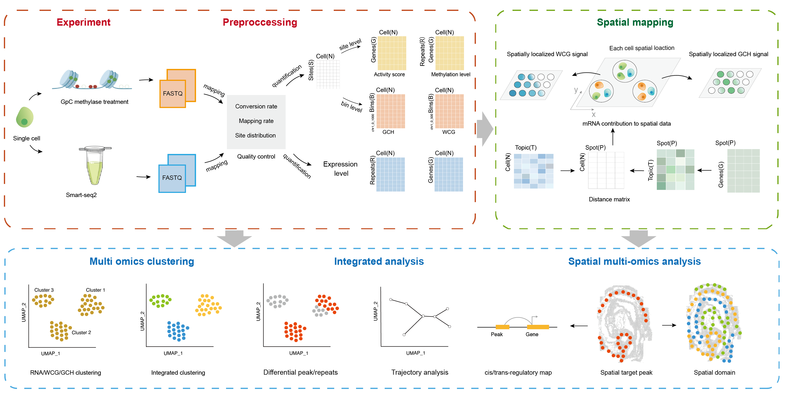

.. MultiSpace documentation master file, created by
   sphinx-quickstart on Sun Jun 19 10:33:38 2022.
   You can adapt this file completely to your liking, but it should at least
   contain the root `toctree` directive.

Welcome to MultiSpace's documentation!
======================================

.. toctree::
   :maxdepth: 2
   :caption: Contents:

|Docs| |Conda|

.. |Docs| image:: https://readthedocs.org/projects/multispace/badge/?version=latest
   :target: https://multispace.readthedocs.io
   image:: https://anaconda.org/changzhanhe/multispace/badges/version.svg

.. |Conda| image:: https://anaconda.org/changzhanhe/multispace/badges/version.svg

MultiSpace(Single-cell Multi Omics Analysis In Space) is a multi-omics pipeline integrated RNA Expression, DNA methylation and Chromatin Accessibility analysis built using snakemake.MultiSpace support scCOOL-seq, scNMT-seq for DNA analysis; Smart-seq2 for RNA analysis. MultiSpace combines several tools and packages to create an integrative pipeline, which enables three omics anaylsis from raw sequencing data (fastq files as input) through alignment, quality control, cell filtering, methylation site calling and filtering, generate site by cell and bin by cell matrix in single cell level. Besides preprocessing, MultiSpace also provides several downstream analysis functions, including (1) gene genebody/promoter DNA methylation ratio, (2) using the regulatory potential model to calculate gene activity score, (3) mapping single cell to spatial location and get spatial epigenetic (DNA methylation/Chromatin Accessibility) signal.

.. include:: release_notes/0.0.1.rst

.. toctree::
   :maxdepth: 1
   :hidden:

   installation
   usage
   examples/Mouse_embryo
   release_notes/index

